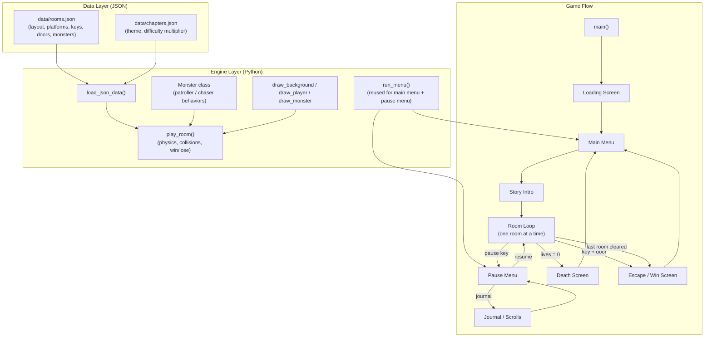

# Hollow Ground

*A pixel-art escape-room platformer about a house that never lets go.*

> You wake up on a cold stone floor. The door is sealed shut. Somewhere in this mansion, a way out exists. Find the keys. Avoid what hunts you. Escape.

Built with **Python** and **pygame-ce**.

---

## Table of Contents

- [Overview](#overview)
- [Features](#features)
- [Architecture](#architecture)
- [Technology Stack](#technology-stack)
- [Installation](#installation)
- [Controls](#controls)
- [Project Structure](#project-structure)
- [Design Decisions](#design-decisions)
- [Scalability Considerations](#scalability-considerations)
- [Roadmap](#roadmap)
- [Contributing](#contributing)
- [License](#license)

---

## Overview

**Hollow Ground** is a 2D platformer where you wake up trapped inside an old family estate, guided room by room through scrolls left behind by **Eleanor**, a voice bound to the house long before you arrived. Each of the five chapters — *The Threshold*, *The Hollow Halls*, *The Crypts*, *The Buried Wing*, and *The Reckoning* — pushes deeper into the house's history: a generations-old bargain, a brother who tried to run, and the ancient, patient thing beneath it all that keeps the debt.

Gameplay is straightforward on the surface — find the key, avoid the monster, reach the door — but the difficulty and story context both escalate as you descend through the house.

## Features

- **Room-by-room platforming** — gravity, jumping, and platform collision built from scratch.
- **Two core monster behaviors, endlessly reskinned:**
  - **Patroller** — walks a fixed path, ignores the player entirely.
  - **Chaser** — sleeps until the player gets close, then actively hunts them down.
- **Chapter-based difficulty scaling** — every room belongs to a chapter, and each chapter defines a `difficulty` multiplier that scales monster speed and awareness automatically.
- **Lives & invincibility system** — three lives per run, with a brief invincibility + knockback window after each hit.
- **Personalized game-over flavor text** — the death screen reads differently depending on which *type* of monster caught you.
- **Data-driven level design** — rooms and chapters live in JSON files, not code. Adding a new room means editing data, not the engine.
- **Full menu flow** — loading screen, main menu, in-run pause menu (Resume / Journal / Restart Room / Quit to Menu), and win/lose screens, all built on one reusable menu function.
- **Story scrolls** *(in progress)* — Eleanor's letters, collected per room, recapped in an in-game journal.

## Architecture

The game is intentionally split into three layers so that **content** (rooms, chapters, story) never requires touching **engine code** (physics, rendering, state machine):



**Core design pattern:** two reusable "shapes" power almost everything:
1. **One `Monster` class, two behaviors** (`patroller`, `chaser`) — every named monster (wolf, vampire, zombie, etc.) is just one of these two behaviors with a different color, speed, and size.
2. **One `run_menu()` function** — powers both the main menu and the in-game pause menu, since both are "a title + a list of selectable options."

## Technology Stack

| Layer              | Choice                          | Why |
|---------------------|----------------------------------|-----|
| Language            | Python 3.x                       | Fast to iterate, readable, huge ecosystem |
| Rendering / Input   | [pygame-ce](https://pyga.me/)    | Community-maintained fork of pygame; active development, simple 2D API |
| Data / Content      | JSON (`data/rooms.json`, `data/chapters.json`) | Human-editable, no code changes needed to add content |
| Version Control     | Git                               | Milestone-based development, tracked from day one |
| Art (current)       | Primitive shapes (rects, ellipses, polygons) | Fast to prototype gameplay before investing in final art |
| Art (planned)       | [PixelLab](https://www.pixellab.ai/) | Generating final pixel-art assets (deferred until gameplay is locked) |

## Installation

**Requirements:** Python 3.10+ recommended, pip.

```bash
# 1. Clone the repository
git clone https://github.com/yourusername/hollow-ground.git
cd hollow-ground

# 2. (Recommended) create a virtual environment
python3 -m venv venv
source venv/bin/activate      # Windows: venv\Scripts\activate

# 3. Install dependencies
pip install pygame-ce

# 4. Run the game
python3 manor.py
```

> **Note:** the game loads its data files relative to the script's own location (`data/rooms.json`, `data/chapters.json`), so it will run correctly regardless of which folder you launch it from — just make sure the `data/` folder stays next to `manor.py`.

## Controls

| Key            | Action                  |
|----------------|--------------------------|
| `A` / `D`      | Move left / right        |
| `Space`        | Jump (also confirms in menus) |
| `↑` / `↓` or `W` / `S` | Navigate menus   |
| `Esc`          | Pause / open pause menu  |

## Project Structure

```
hollow-ground/
├── manor.py              # Main game engine (physics, rendering, state machine)
├── data/
│   ├── rooms.json        # All room layouts: platforms, doors, keys, monsters
│   └── chapters.json     # Chapter themes + difficulty multipliers
├── assets/                # (planned) sprites, sound, fonts
├── .gitignore
├── LICENSE
└── README.md
```

## Design Decisions

- **Data-driven rooms over hardcoded levels.** Rooms and chapters are pure JSON. This means level design (currently ~50 rooms planned) can happen without ever opening the Python file, and eventually could be produced by a level-authoring tool (see Roadmap).
- **Behavior-based monsters, not one-class-per-monster.** Rather than writing a `Werewolf` class, a `Vampire` class, etc., every monster is a `patroller` or a `chaser` with different stats. This keeps the monster system small and makes new "monsters" a content change (new JSON entry), not a code change.
- **Chapter-level difficulty scaling.** Each chapter defines a single `difficulty` number that scales every monster's speed and detection radius inside it. This keeps pacing centrally tunable instead of hand-tuning every room individually.
- **One generic menu function.** The main menu and pause menu are visually and functionally similar (title + selectable list), so they share one `run_menu()` implementation instead of two near-duplicate ones.
- **Personalized failure states.** Death messages reference both the room name and the *kind* of monster that caught the player, so failure feels tied to the story rather than being a generic "Game Over."
- **Story delivered in short bursts.** Most scrolls are one sentence, readable mid-platforming without stopping the action; only a handful of "★" rooms per chapter get longer, scene-setting text — so pacing and narrative depth are balanced deliberately.

## Scalability Considerations

- **Content scaling:** because rooms/chapters are JSON, growing from the current room set to the full ~50-room plan doesn't require refactoring the engine — only adding data. A future level-authoring tool (Milestone 10) can generate this JSON directly.
- **Monster variety:** new monster *types* (Flyer, Shooter — Milestone 7) can be added as new `kind` values in the `Monster` class without changing how rooms reference or place monsters.
- **Difficulty tuning:** since difficulty is a per-chapter multiplier rather than per-monster hardcoded values, rebalancing the whole game's difficulty curve is a small, centralized change.
- **Asset swapping:** all visuals are currently drawn as primitive shapes rather than image files, which was a deliberate choice to decouple gameplay/physics work from art production — pixel art (Milestone 8.5/9) can be swapped in later without touching game logic.
- **Save/checkpoint system (planned):** currently a full run is lost on death or quit; Milestone 11 will introduce persistence so progress scales with the growing room count.
- **Platform scaling:** the long-term option of a mobile port (Milestone 17) is left open by keeping input handling (`pygame.key.get_pressed()`) isolated, making a future touch-input layer a more contained change.

## Roadmap

| # | Milestone | Status |
|---|-----------|--------|
| 0 | Set up git version control | ✅ Done |
| 1 | Loading screen + main menu + pause menu | ✅ Done |
| 2 | Game over screen, personalized flavor text | ✅ Done |
| 3 | Refactor room + chapter data into JSON files | ✅ Done |
| 4 | Scroll system + journal recap screen | ⬜ Not started |
| 5 | Write scroll content (all 5 chapters) | ✅ Done (written, not yet wired in) |
| 6 | Chapter-end "wing complete" transition screens | ⬜ Not started |
| 7 | Two more monster behaviors (Flyer, Shooter) | ⬜ Not started |
| 8 | Full sound pass | ⬜ Not started |
| 8.5 | Base pixel art assets | 🔶 In progress (deferred, using shapes for now) |
| 9 | Animations | ⬜ Not started |
| 10 | Level-authoring tool | ⬜ Not started |
| 11 | Save/checkpoint system | ⬜ Not started |
| 12 | Settings | ⬜ Not started |
| 13 | Coins + shop + cosmetics | ⬜ Not started |
| 14 | Content: design remaining ~47 rooms | ⬜ Not started |
| 15 | Full playtest + difficulty tuning | ⬜ Not started |
| 16 | Credits screen + app icon/branding | ⬜ Not started |
| 17 | Mobile port / Play Store decision | ⬜ Not started |

## Contributing

This is currently a solo/learning project built milestone by milestone. Issues and suggestions are welcome, but please open an issue before submitting a large pull request so it can be discussed against the roadmap above first.

## License

Distributed under the MIT License. See [`LICENSE`](./LICENSE) for details.
